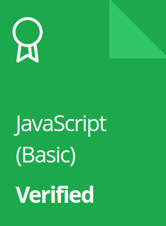
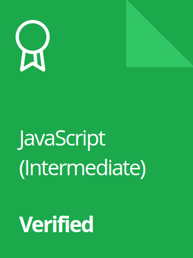
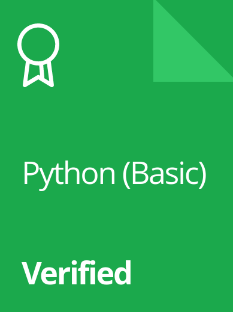
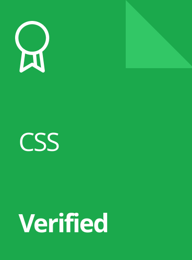

# Education & Experience

 

<h2 id="top">Table Of Contents</h2>

-----------------------------------------------
+ [Badges](https://github.com/BrentGoodman/Certificates#badges)
+ [Programming Certificate's](https://github.com/BrentGoodman/Certificates#programming)
+ [Professional Certificate's](https://github.com/BrentGoodman/Certificates#professional)

 
 

<h3 id="badges">Badges</h3>

-----------------------------------------------

 

<h3 align="center">Hacker Rank .com</h3>

 

| JavaScript Basic  &nbsp;  &nbsp; |  JavaScript Intermediate | Python Basic | CSS  &nbsp;  &nbsp;  &nbsp;|
| :---------------: | :---------------: | :---------------: | :---------------: |
|  |  |  |  |
  

 

-----------------------------------------------

 

<h3 align="center">Coding Ninjas .com</h3>

 

| Programming in C++  &nbsp; |  OOPS in C++ &nbsp;  &nbsp; | Programming in Java &nbsp;  &nbsp;  | OOPS in Java &nbsp;  &nbsp; |
| :---------------: | :---------------: | :---------------: | :---------------: |
|  |  |  |  |
| Sensei Badge | Sensei Badge |  Sensei Badge |  Sensei Badge | 

  
 

-----------------------------------------------

 

<h3 align="center">SkillFront</h3>

 

|  ISO/IEC 20000 IT Service Mgmt. Assoc. | ISO 9001 Quality Mgmt. Systems Assoc. | ISO/IEC 27001 Information Security Assoc. |
| :---------------: | :---------------: | :---------------: |
|  |  |  |

| Lean Foundation Professional Cert.  &nbsp; &nbsp; &nbsp;  |  Insurance Fundementals Professional Cert. &nbsp; | Foundation of Entrepreneurship  &nbsp;  &nbsp; &nbsp; |
| :---------------: | :---------------: | :---------------: |
|  |  |  |

  

 

-----------------------------------------------

 

<h3 align="center">CertiProf</h3>

 

| Scrum Foundation Professional Cert.     |  Remote Worker Professional Cert. |
| :---------------: | :---------------: |
|  |  |

  
 
 

## Certificate's
-----------------------------------------------

 

<h3 id="programming">Programming Certificate's</h3>

-----------------------------------------------

| | Certificate      | Issued by | Link to Certificate |
| :---------------: | :--------------- | :---------------: | :---------------: |
| :heavy_check_mark: |   JavaScript Algorithms and Data Structures   | freeCodeCamp       | [Certificate Verification](https://freecodecamp.org/certification/fcc45c48335-657e-47ed-8aab-dbb4ec473c7a/javascript-algorithms-and-data-structures) |
| :heavy_check_mark: |   Python Programming: Data Structure, Animation and Arrays   | Kaggle       | [Certificate Verification](https://www.kaggle.com/learn/certification/brentgoodman/python) |
| :heavy_check_mark: |   Python Development Course   | LearnX.org Credential ID: **58115691-a97a-4489-b6af-025a3dbcd5b4**       | [Certificate Verification](https://www.learnx.org/certificate/58115691-a97a-4489-b6af-025a3dbcd5b4) |
| :heavy_check_mark: |   Programming in C++ Certificate  | Coding Ninjas  | [Certificate Verification](https://files.codingninjas.in/certificate-263383-757c0e3703c9239a979384761e5fe919.pdf) |
| :heavy_check_mark: |   CSS (Cascading Style Sheets) Certificate   | HackerRank Credential ID: **FBF3411C6C29**       | [Certificate Verification](https://www.hackerrank.com/certificates/fbf3411c6c29) |
| :heavy_check_mark: |   Intro to Machine Learning  | Kaggle     | [Certificate Verification](https://www.kaggle.com/learn/certification/brentgoodman/intro-to-machine-learning) |
| :heavy_check_mark: |   Python (Basic) Certificate   | HackerRank Credential ID: **0238C6008E39**       | [Certificate Verification](https://www.hackerrank.com/certificates/0238c6008e39) |
| :heavy_check_mark: |   JavaScript (Basic) Certificate   | HackerRank Credential ID: **3C2972924A06**      | [Certificate Verification](https://www.hackerrank.com/certificates/3c2972924a06) |
| :heavy_check_mark: |   JavaScript (Intermediate) Certificate   | HackerRank Credential ID: **C7A9A32F03C3**       | [Certificate Verification](https://www.hackerrank.com/certificates/c7a9a32f03c3) |
| :heavy_check_mark: |   Data Analysis with Pandas in Python   | Kaggle       | [Certificate Verification](https://www.kaggle.com/learn/certification/brentgoodman/pandas) |

  
 

<h3 id="professional">Professional Certificate's</h3>

-----------------------------------------------------

| | Certificate      | Issued by | Link to Certificate |
| :---------------: | :--------------- | :---------------: | :---------------: |
| :heavy_check_mark: |    Certificate in Real Estate Sales   | Santa Rosa Junior College       | [Certificate Verification](https://drive.google.com/file/d/1sGjIDlyDhKiSWWXsugu-cJjX0AlAkRz7/view?usp=share_link) |
| :heavy_check_mark: |    Career Essentials in Project Management   | Microsoft       | [Certificate Verification](https://www.linkedin.com/learning/certificates/e6faf32cabb4eb29d1749f22e61fced51bc3385a0143c8f7e71eed7422f27304) |
| :heavy_check_mark: |   Managing Projects with Microsoft 365   | Microsoft Credential ID: **Ac4Mk89kCCKu8xkDAIuMY-OeWKtJ**       | [Certificate Verification](https://www.linkedin.com/learning/certificates/e9a639eb3f193fd0db181369bd4862acd6ab7c66bd61e54d39bc73468939d051) |
| :heavy_check_mark: |    Career Essentials in Administrative Assistance   | Microsoft       | [Certificate Verification](https://www.linkedin.com/learning/certificates/ff6c3d0433c8dc653608cb4f88d61af165fc690d15902d00b76f37dff3d19919) |
| :heavy_check_mark: |   Lean Foundations Professional CertificationTM (LFPTM)   | SkillFront Credential ID: **02342944096298** | [Certificate Verification](https://www.skillfront.com/Badges/02342944096298) |
| :heavy_check_mark: |    Scrum Foundation Professional Certificate - SFPCTM   | CertiProf / Credly Credential ID: **81779484**      | [Certificate Verification](https://www.credly.com/badges/f73ad134-5c01-49d8-afe8-f5ebf24cdefc/public_url) |
| :heavy_check_mark: |    ISO/IEC 27001 Information Security AssociateTM   | SkillFront Credential ID: **99241047619981**       | [Certificate Verification](https://www.skillfront.com/Badges/99241047619981) |
| :heavy_check_mark: |   ISO 9001 Quality Management Systems AssociateTM   | SkillFront Credential ID: **63137399051143**       | [Certificate Verification](https://www.skillfront.com/Badges/63137399051143) |
| :heavy_check_mark: |   ISO/IEC 20000 IT Service Management AssociateTM   | SkillFront Credential ID: **38812845701689**       | [Certificate Verification](https://www.skillfront.com/Badges/38812845701689) |
| :heavy_check_mark: |   Revenue Operations Certificate   | HubSpot Credential ID: **875e2a60f83d4f6380e25765b93dd694**       | [Certificate Verification](https://drive.google.com/file/d/1Z0rhN0_H3oZttP6nzwqPvNh_fwhHnDO6/view?usp=share_link) |
| :heavy_check_mark: |  Certified Insurance Industry FundamentalsTM (CIIFTM)   | SkillFront       | [Certificate Verification](https://www.skillfront.com/Badges/76626941870193) |
| :heavy_check_mark: | Foundations Of Business And EntrepreneurshipTM   | SkillFront       | [Certificate Verification](https://www.skillfront.com/Badges/26878082394786) |
| :heavy_check_mark: |  Remote Worker Professional Certificate (RWPCTM)   | CertiProf       | [Certificate Verification](https://www.credly.com/badges/5e162956-50ef-47a3-b1c8-bfefed92e196/public_url) |

 
 

<a href="#top"><strong>Top of Page</strong></a>

